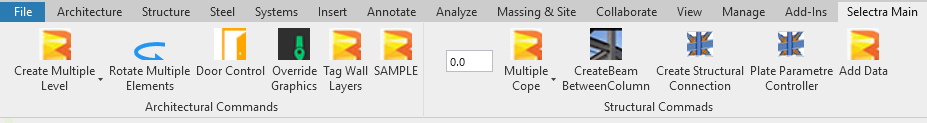
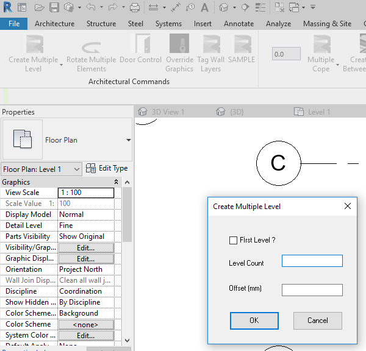

# __SeLeCtRa_REVIT__
This is my personal project that includes a Revit Tab and many add-ins in it.
It contains many different type addins.
For compiling this project you need .Net Framework 4.7 or higher and Visual Studio 2017 or higher. (VS Studio 2019 Recommended)
DLLs in the dependecies folder are Revit and Advance Steel 2020 version files.

## __All Commands__

---
### __Tag Wall Layers Button__

======
### __Auto Cope Split Buttons__

======
### __Create Structural Connection Button__

======
### __Door Direction Control__

======
### __Create and Modify Levels__

