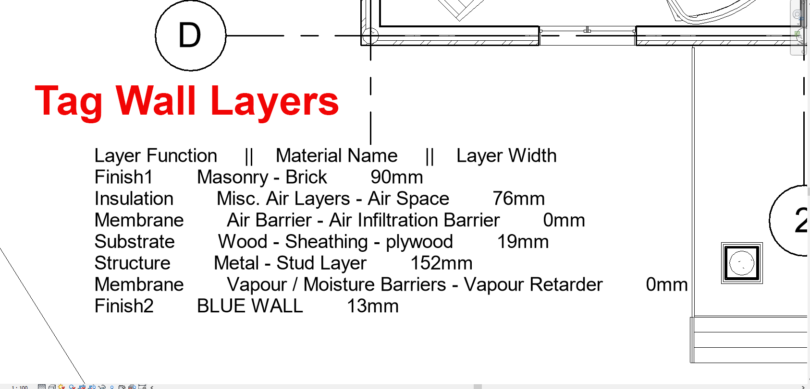
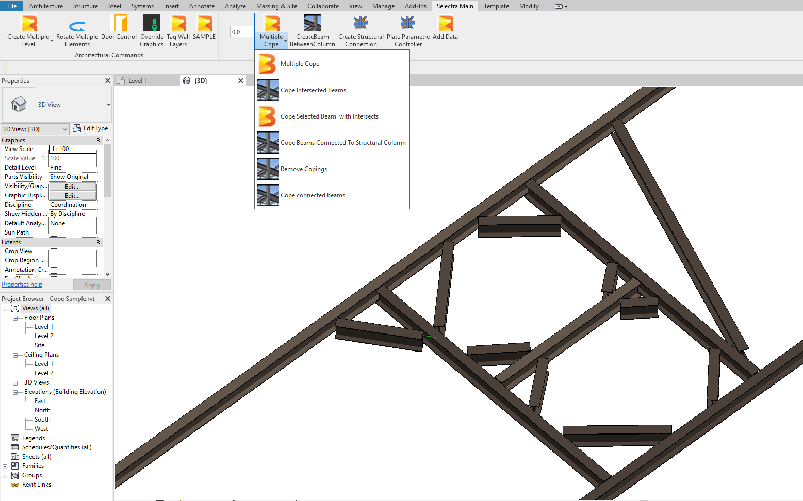
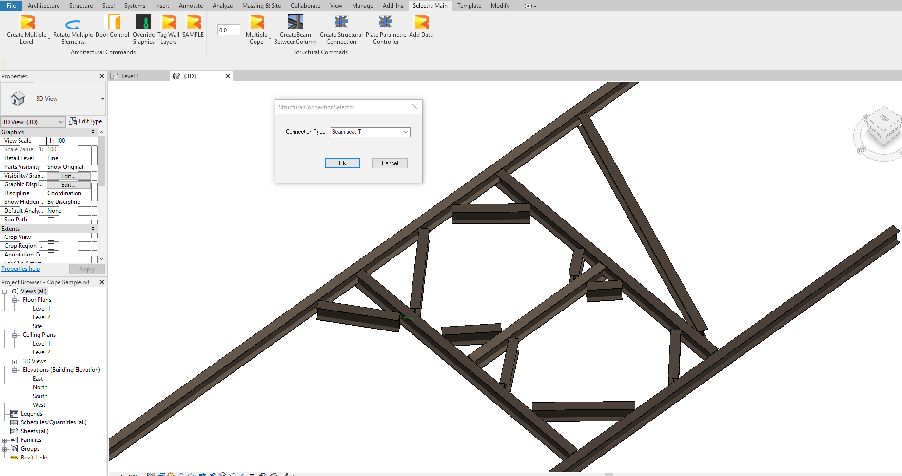
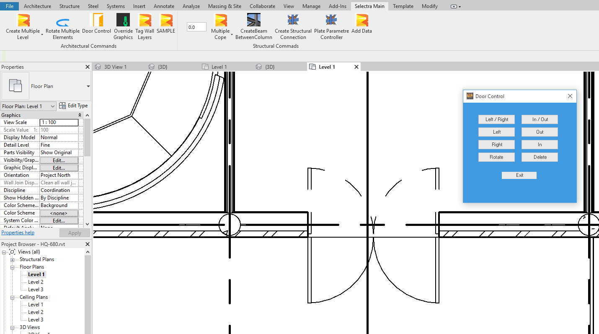

# SeLeCtRa_REVIT
This is my personal project that includes a Revit Tab and many add-ins in it.
It contains many different type addins.
For compiling this project you need .Net Framework 4.7 or higher and Visual Studio 2017 or higher. (VS Studio 2019 Recommended)
DLLs in the dependecies folder are Revit and Advance Steel 2020 version files.

## All Commands

### Tag Wall Layers Button

### Auto Cope Split Buttons

### Create Structural Connection Button

### Door Direction Control

### Create and Modify Levels

